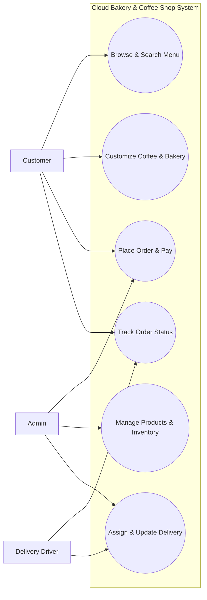
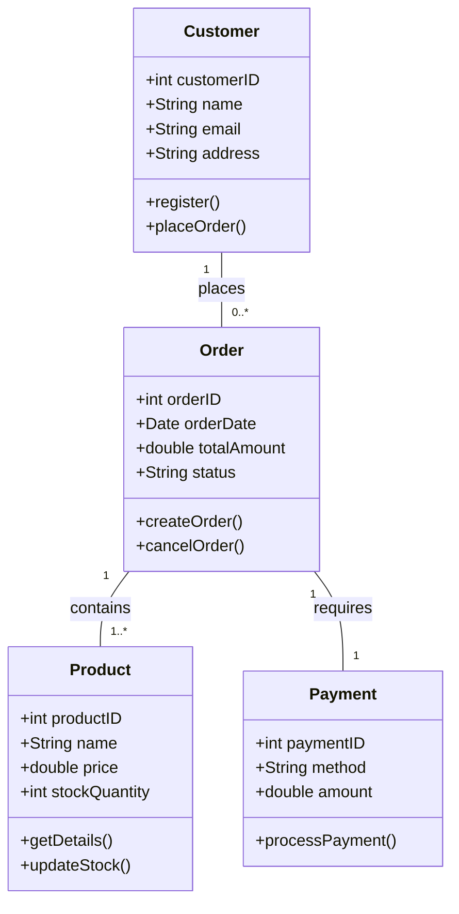
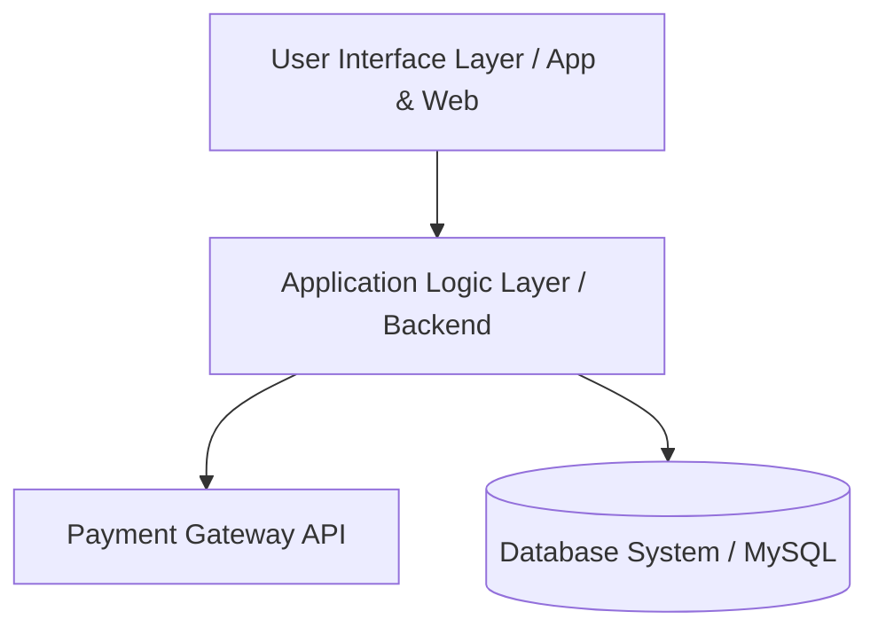

## 3. التحليل والتصميم باستخدام مخططات UML

### أ. مخطط حالات الاستخدام (Use Case Diagram)

---

### ب. مخطط الفئات (Class Diagram)

---

### ج. مخطط المكونات والمعمارية (Component Architecture)

